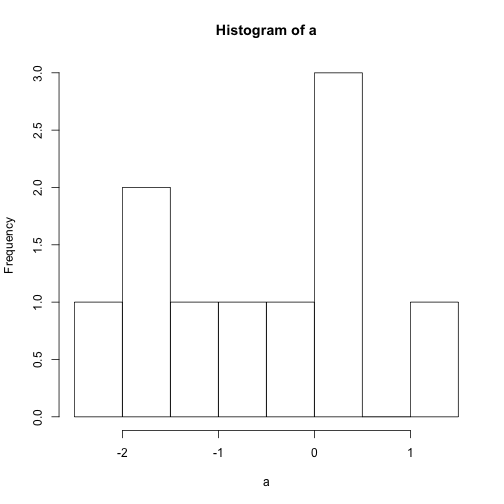
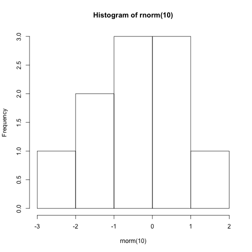

A Brief Introduction To R
========================================================

In the first hour we'll do a brief tour of the R programming language. 

R is the most popular programming language for statistics and data analysis.

R is an open-source implementation of the programming language S. S was developed by John Chambers at Bell Laboratories in 1976.

The thing that makes R so powerful is the enormous number of libraries that exist for it. We'll use some of them later.

Using R
------------------
R is most often used interactively. That means that we care more about the code written during an R session is not saved, but only the output (e.g. graphics). (Although, to create reproducible research it might make sense to keep the code.)

There are two primary ways of using R:
- The command line
- RStudio (open-source IDE)

RStudio is generally more pleasant and powerful.

First Steps
------------------


```r
5
```

```
## [1] 5
```

```r
print(10)
```

```
## [1] 10
```

```r
6 + 7
```

```
## [1] 13
```


An important thing is to be in the right working directory. 

In RStudio, you can set the working directory under 'Session > Set Working Directory'

Or you can set it directly in the console: 


```r
getwd()
```

```
## [1] "/Users/briancrain/Documents/quantified_self/R_WORKSHOP/measured_me_rws"
```

```r
setwd("/Users/briancrain/Documents/quantified_self/R_WORKSHOP/measured_me_rws/")
```


If you don't know something, the help function is very useful.

```r
help(mean)
```


There is also a shortcut.

```r
`?`(mean)
```


Seeing examples is useful too.

```r
example(mean)
```

```
## 
## mean> x <- c(0:10, 50)
## 
## mean> xm <- mean(x)
## 
## mean> c(xm, mean(x, trim = 0.10))
## [1] 8.75 5.50
```


Functions
------------------
Functions are extremely important in R.

They are simple to call.


```r
print("Hello")
```

```
## [1] "Hello"
```


Let's generate a random number.

```r
rnorm(1)
```

```
## [1] -2.038
```


Or two.

```r
rnorm(2)
```

```
## [1] -0.4968 -1.5164
```


We can also take the mean of two random numbers.


```r
mean(rnorm(2))
```

```
## [1] -0.7103
```


Or we can save the random numbers first and then take the mean.


```r
v <- rnorm(2)
mean(v)
```

```
## [1] -1.047
```


There two main ways to save variables in R.


```r
v <- rnorm(2)
```

This is also possible: rnorm(2) -> v

Calling variables is simple.

```r
v
```

```
## [1]  1.5544 -0.2135
```


Something more fun.


```r
a <- rnorm(10)
hist(a)
```

 


You could also do it like this.

```r
hist(rnorm(10))
```

 


Before we move on, let's write our own function. 

```r
f <- function(a) {
    a + 1
}
f(5)
```

```
## [1] 6
```

R functions always return the last line, but you could also use return explicitly.

```r
f <- function(a) {
    return(a + 1)
    print("I never get called")
}
f(5)
```

```
## [1] 6
```


Data Types
------------------
### Vectors

The most fundamental data type in R is the vector.

This is the standard way of creating a vector:

```r
a <- c(7)
```

But this is really a vector too:

```r
7
```

```
## [1] 7
```

```r
typeof(7) == typeof(c(7))
```

```
## [1] TRUE
```


You can have lots of elements in a vector. 

```r
c(7, 4, 9)
```

```
## [1] 7 4 9
```

```r
c(1:100)
```

```
##   [1]   1   2   3   4   5   6   7   8   9  10  11  12  13  14  15  16  17
##  [18]  18  19  20  21  22  23  24  25  26  27  28  29  30  31  32  33  34
##  [35]  35  36  37  38  39  40  41  42  43  44  45  46  47  48  49  50  51
##  [52]  52  53  54  55  56  57  58  59  60  61  62  63  64  65  66  67  68
##  [69]  69  70  71  72  73  74  75  76  77  78  79  80  81  82  83  84  85
##  [86]  86  87  88  89  90  91  92  93  94  95  96  97  98  99 100
```


But they need to be of the same type

```r
c(7, "dog")
```

```
## [1] "7"   "dog"
```

As you can see R coeerces both into a string here so the type is the same.

Here is how you access elements of a vector.

```r
a <- 1:100
a[1]
```

```
## [1] 1
```

```r
a[56]
```

```
## [1] 56
```

```r
a[3 * 1:25]
```

```
##  [1]  3  6  9 12 15 18 21 24 27 30 33 36 39 42 45 48 51 54 57 60 63 66 69
## [24] 72 75
```

```r
a[a%%3 == 0]
```

```
##  [1]  3  6  9 12 15 18 21 24 27 30 33 36 39 42 45 48 51 54 57 60 63 66 69
## [24] 72 75 78 81 84 87 90 93 96 99
```

Note: Indexing starts at 1 in R, not at 0 like in python, javascript, etc.

What happens when you multiply a vector?

```r
a * 2
```

```
##   [1]   2   4   6   8  10  12  14  16  18  20  22  24  26  28  30  32  34
##  [18]  36  38  40  42  44  46  48  50  52  54  56  58  60  62  64  66  68
##  [35]  70  72  74  76  78  80  82  84  86  88  90  92  94  96  98 100 102
##  [52] 104 106 108 110 112 114 116 118 120 122 124 126 128 130 132 134 136
##  [69] 138 140 142 144 146 148 150 152 154 156 158 160 162 164 166 168 170
##  [86] 172 174 176 178 180 182 184 186 188 190 192 194 196 198 200
```

Operations are always applied element-wise. This is very important.

### Lists

We'll just cover lists very briefly. They can contain different data types.

```r
L <- list(name = "Sam", age = 7)
```

Elements can be accessed by position or name.

```r
L$name
```

```
## [1] "Sam"
```

```r
L[[2]]
```

```
## [1] 7
```


### Data Frames

Data frames are the data type you will work with the most. The graphics package ggplot2, for example, only accepts data frames.

A data frame is a list with class 'data.frame'. Works a bit like a table in a database or like an excel sheet.

Let's create one.

```r
data.frame(home = "Florida", income = 10000)
```

```
##      home income
## 1 Florida  10000
```

```r
(accountant <- data.frame(home = c("Florida", "Berlin"), income = c(10000, 23456), 
    stringsAsFactors = FALSE))
```

```
##      home income
## 1 Florida  10000
## 2  Berlin  23456
```


Let's add a row.

```r
accountant[3, ] <- c("Hungary", 43)
accountant
```

```
##      home income
## 1 Florida  10000
## 2  Berlin  23456
## 3 Hungary     43
```


Let's look at the mean income.

```r
mean(accountant$income)
```

```
## [1] NA
```


You can also embed plots, for example:


```r
plot(cars)
```

 


