Exploration of the Measured Me dataset - A introduction to R for Quantified-Self Enthusiasts
===========================================================================================

Data provided by [Measured Me](http://measuredme.com/). Thanks!

This worksheet was created in R Markdown. Markdown is a simple formatting syntax for authoring web pages. You can load up this worksheet in R Studio to run the examples directly and explore yourself!

## Load the data

Read in the csv file.

```r
mm <- read.csv("measured me data may-oct2013.csv")
```


Let's take a look at the first few rows.

```r
head(mm)
```

```
##     Date Health Energy Stress MoodPos MoodInt Alertness Cognition Hap
## 1 May 27    3.7    7.3    2.4     7.6     5.6        34       9.4 6.8
## 2 May 28    4.0    6.5    4.2     5.5     5.3        34      10.1 4.9
## 3 May 29    4.0    6.2    4.1     7.2     6.0        34      10.1 7.0
## 4 May 30    3.8    7.7    2.4     6.5     5.8        36      10.2 5.5
## 5 May 31    4.0    5.8    3.2     6.5     5.6        33      10.2 6.4
## 6 June 1    3.8    6.3    2.7     7.3     4.5        31      10.9 7.2
##   LifeSat SlpTime SlpEff Calories ModAct VigAct Steps
## 1     7.4     497     91       NA     NA     NA    NA
## 2     6.2     476     95     2792    161      1 10827
## 3     7.0     476     88     3092    223      6 16992
## 4     6.0     481     77     3024    205      2 13492
## 5     6.8     451     88     3419    325      4 17663
## 6     7.0     380     96     3464    306      1 18840
```


It appears that the first column is a date, in an odd format.

```r
str(mm)
```

```
## 'data.frame':	147 obs. of  16 variables:
##  $ Date     : Factor w/ 147 levels "August 1","August 10",..: 93 94 95 96 97 63 74 85 87 88 ...
##  $ Health   : num  3.7 4 4 3.8 4 3.8 4 3.8 4 4 ...
##  $ Energy   : num  7.3 6.5 6.2 7.7 5.8 6.3 5.1 4.8 5.2 4.8 ...
##  $ Stress   : num  2.4 4.2 4.1 2.4 3.2 2.7 2.1 3.1 4 2 ...
##  $ MoodPos  : num  7.6 5.5 7.2 6.5 6.5 7.3 7.6 6.1 5.9 6.9 ...
##  $ MoodInt  : num  5.6 5.3 6 5.8 5.6 4.5 4.3 4.2 4.9 4.8 ...
##  $ Alertness: int  34 34 34 36 33 31 34 33 32 31 ...
##  $ Cognition: num  9.4 10.1 10.1 10.2 10.2 10.9 11.2 10.4 10.6 10.6 ...
##  $ Hap      : num  6.8 4.9 7 5.5 6.4 7.2 6.9 5.3 5 6.2 ...
##  $ LifeSat  : num  7.4 6.2 7 6 6.8 7 6.6 6.1 6.6 6.6 ...
##  $ SlpTime  : int  497 476 476 481 451 380 437 489 479 503 ...
##  $ SlpEff   : int  91 95 88 77 88 96 91 92 89 89 ...
##  $ Calories : int  NA 2792 3092 3024 3419 3464 3196 2871 3312 3170 ...
##  $ ModAct   : int  NA 161 223 205 325 306 220 179 263 238 ...
##  $ VigAct   : int  NA 1 6 2 4 1 0 5 10 1 ...
##  $ Steps    : int  NA 10827 16992 13492 17663 18840 17330 9466 13236 16856 ...
```


Yes, R isn't recognising it as a date. R thinks it's a categorical variable, or `factor`.

We can parse it so that R may convert it into the `Date` data type. There's a nice library to make this a bit easier. It also looks like the year is missing so we'll add that too.

```r
library(lubridate)
mm$Date <- parse_date_time(mm$Date, "md")
year(mm$Date) <- 2013
```


Then we can check to see if it worked.

```r
class(mm$Date)
```

```
## [1] "POSIXct" "POSIXt"
```

```r
summary(mm$Date)
```

```
##                  Min.               1st Qu.                Median 
## "2013-05-27 00:00:00" "2013-07-02 12:00:00" "2013-08-08 00:00:00" 
##                  Mean               3rd Qu.                  Max. 
## "2013-08-08 00:00:00" "2013-09-13 12:00:00" "2013-10-20 00:00:00"
```


Great. Looks like we're ready to get started.


## Exploratory Visualisations
The excellent [GGplot2 library](http://docs.ggplot2.org/current/) implements the [Grammar of Graphics](http://www.springer.com/statistics/computational+statistics/book/978-0-387-24544-7).

Note the pause between charts is intended for interactive use.


```r
library(ggplot2)

for (var in colnames(mm)[2:ncol(mm)]) {
    print(qplot(Date, mm[, var], data = mm, geom = "path", ylab = var))
    key <- readline("Press <return> for next plot")
    if (key != "") {
        break
    }
}
```

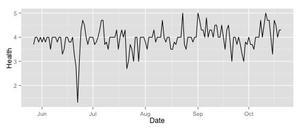 

```
## Press <return> for next plot
```

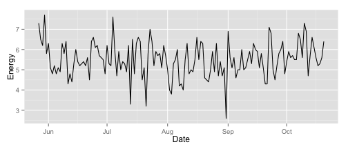 

```
## Press <return> for next plot
```

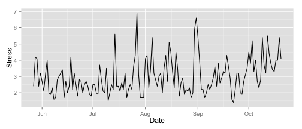 

```
## Press <return> for next plot
```

 

```
## Press <return> for next plot
```

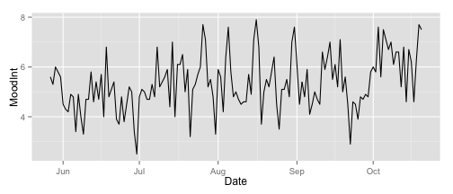 

```
## Press <return> for next plot
```

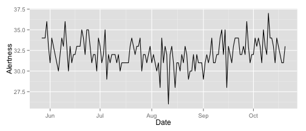 

```
## Press <return> for next plot
```

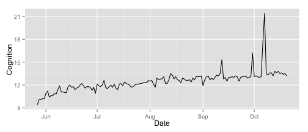 

```
## Press <return> for next plot
```

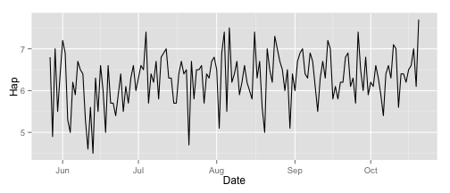 

```
## Press <return> for next plot
```

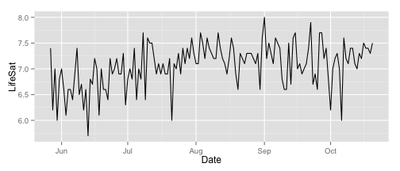 

```
## Press <return> for next plot
```

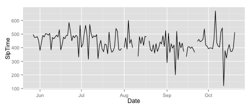 

```
## Press <return> for next plot
```

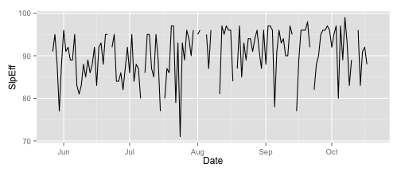 

```
## Press <return> for next plot
```

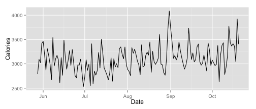 

```
## Press <return> for next plot
```

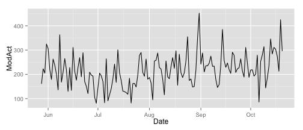 

```
## Press <return> for next plot
```

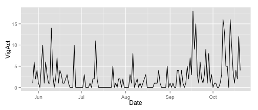 

```
## Press <return> for next plot
```

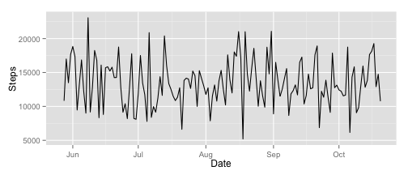 

```
## Press <return> for next plot
```


To plot these trends on the same chart we must first [normalise the data](http://en.wikipedia.org/wiki/Database_normalization). The `reshape2` library provides the `melt` function for this purpose.


```r
library(reshape2)
mm.melted <- melt(mm, id.vars = "Date")
head(mm.melted)
```

```
##         Date variable value
## 1 2013-05-27   Health   3.7
## 2 2013-05-28   Health   4.0
## 3 2013-05-29   Health   4.0
## 4 2013-05-30   Health   3.8
## 5 2013-05-31   Health   4.0
## 6 2013-06-01   Health   3.8
```


```r
ggplot(mm.melted, aes(Date, value)) + geom_path(na.rm = T) + geom_smooth(method = "loess", 
    na.rm = T) + facet_wrap(~variable, ncol = 1, scales = "free_y")
```

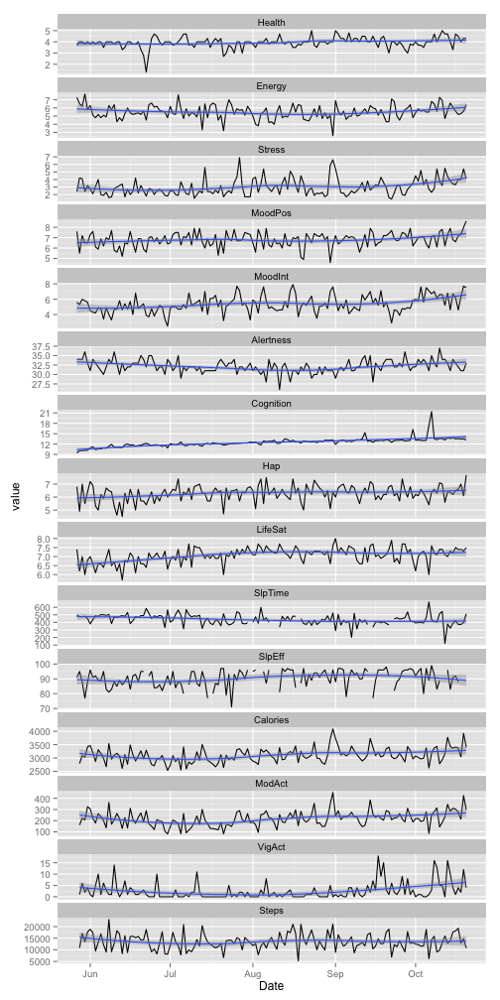 


We can create bivariate plots to investigate the relationships between variables.

```r
ggplot(mm, aes(Calories, Steps)) + geom_path(aes(colour = as.integer(row.names(mm))), 
    alpha = 0.5, na.rm = T)
```

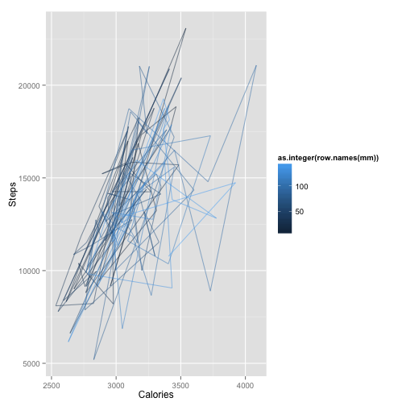 

```r
ggplot(mm, aes(Stress, MoodInt)) + geom_path(aes(colour = as.integer(row.names(mm))), 
    alpha = 0.5, na.rm = T)
```

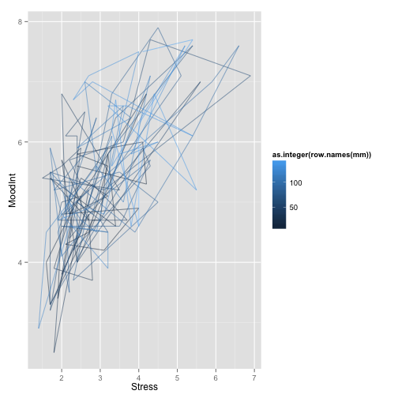 


## Modeling
### Correlation Matrices

While bivariate comparisons are insightful, we must produce and inspect 240 charts to cover the whole dataset. Instead lets measure the correlation systematically.

First we create a matrix, removing the `Date` column. Then we produce a correlation matrix, specifying that we only want to use those observations that are complete (i.e. ignoring those which have missing data). Without this specification we would see `NA` in the results.


```r
mm.matrix <- as.matrix(mm[, 2:ncol(mm)])
cor(mm.matrix, use = "complete.obs")
```

```
##              Health   Energy    Stress  MoodPos  MoodInt Alertness
## Health     1.000000  0.15487  0.123719  0.07750  0.13710  -0.24514
## Energy     0.154873  1.00000  0.019440  0.26368  0.17468   0.14634
## Stress     0.123719  0.01944  1.000000 -0.32090  0.60407  -0.10078
## MoodPos    0.077496  0.26368 -0.320901  1.00000 -0.02472   0.03637
## MoodInt    0.137100  0.17468  0.604073 -0.02472  1.00000  -0.06192
## Alertness -0.245144  0.14634 -0.100779  0.03637 -0.06192   1.00000
## Cognition  0.118308  0.04073  0.107536  0.09301  0.33094   0.03579
## Hap        0.150309  0.21266 -0.242305  0.76335  0.08041  -0.09034
## LifeSat    0.198479  0.14436 -0.075554  0.56699  0.15495  -0.17061
## SlpTime   -0.209551  0.04977  0.003363 -0.15531  0.01683   0.20749
## SlpEff    -0.131237 -0.24750  0.205968 -0.11285  0.07704   0.09836
## Calories   0.170503 -0.02315  0.337259  0.12318  0.25702  -0.21571
## ModAct     0.126707 -0.05459  0.340165  0.07994  0.26335  -0.15402
## VigAct     0.114927  0.12056  0.118884  0.06203  0.06616   0.03353
## Steps      0.007393 -0.13520  0.119415 -0.05594  0.17887  -0.08102
##           Cognition      Hap  LifeSat   SlpTime   SlpEff Calories   ModAct
## Health      0.11831  0.15031  0.19848 -0.209551 -0.13124  0.17050  0.12671
## Energy      0.04073  0.21266  0.14436  0.049773 -0.24750 -0.02315 -0.05459
## Stress      0.10754 -0.24230 -0.07555  0.003363  0.20597  0.33726  0.34016
## MoodPos     0.09301  0.76335  0.56699 -0.155313 -0.11285  0.12318  0.07994
## MoodInt     0.33094  0.08041  0.15495  0.016829  0.07704  0.25702  0.26335
## Alertness   0.03579 -0.09034 -0.17061  0.207488  0.09836 -0.21571 -0.15402
## Cognition   1.00000  0.14150  0.28114 -0.084692  0.27690  0.09781  0.09779
## Hap         0.14150  1.00000  0.68344 -0.195373 -0.03921  0.22447  0.17550
## LifeSat     0.28114  0.68344  1.00000 -0.293535  0.02668  0.41455  0.32516
## SlpTime    -0.08469 -0.19537 -0.29354  1.000000  0.01680 -0.29664 -0.19182
## SlpEff      0.27690 -0.03921  0.02668  0.016800  1.00000  0.05235  0.08259
## Calories    0.09781  0.22447  0.41455 -0.296643  0.05235  1.00000  0.93781
## ModAct      0.09779  0.17550  0.32516 -0.191825  0.08259  0.93781  1.00000
## VigAct      0.06835  0.00434  0.03085 -0.077289  0.03581  0.28017  0.31160
## Steps      -0.04752  0.09835  0.16065 -0.160442  0.05410  0.61103  0.64988
##             VigAct     Steps
## Health     0.11493  0.007393
## Energy     0.12056 -0.135203
## Stress     0.11888  0.119415
## MoodPos    0.06203 -0.055944
## MoodInt    0.06616  0.178865
## Alertness  0.03353 -0.081018
## Cognition  0.06835 -0.047523
## Hap        0.00434  0.098349
## LifeSat    0.03085  0.160647
## SlpTime   -0.07729 -0.160442
## SlpEff     0.03581  0.054098
## Calories   0.28017  0.611029
## ModAct     0.31160  0.649879
## VigAct     1.00000 -0.038013
## Steps     -0.03801  1.000000
```


Although this is a good start, we can now see the Pearson correlation coefficient for each pair, it immediately raises the question: which are statistically significant? Enter the `Hmisc` library.


```r
library(Hmisc)
rcorr(mm.matrix)
```

```
##           Health Energy Stress MoodPos MoodInt Alertness Cognition   Hap
## Health      1.00   0.17   0.17    0.15    0.17     -0.17      0.13  0.18
## Energy      0.17   1.00  -0.02    0.29    0.16      0.18      0.01  0.23
## Stress      0.17  -0.02   1.00   -0.28    0.61     -0.09      0.14 -0.24
## MoodPos     0.15   0.29  -0.28    1.00    0.01      0.06      0.09  0.76
## MoodInt     0.17   0.16   0.61    0.01    1.00     -0.05      0.31  0.08
## Alertness  -0.17   0.18  -0.09    0.06   -0.05      1.00      0.03 -0.07
## Cognition   0.13   0.01   0.14    0.09    0.31      0.03      1.00  0.12
## Hap         0.18   0.23  -0.24    0.76    0.08     -0.07      0.12  1.00
## LifeSat     0.23   0.17  -0.07    0.59    0.13     -0.14      0.26  0.70
## SlpTime    -0.24   0.09  -0.10   -0.10    0.01      0.14     -0.12 -0.11
## SlpEff     -0.13  -0.24   0.21   -0.11    0.08      0.10      0.27 -0.04
## Calories    0.10  -0.02   0.35    0.14    0.31     -0.16      0.12  0.20
## ModAct      0.06  -0.04   0.35    0.10    0.31     -0.10      0.12  0.15
## VigAct      0.12   0.14   0.15    0.10    0.11      0.04      0.08  0.01
## Steps      -0.06  -0.16   0.15   -0.10    0.22     -0.03     -0.02  0.04
##           LifeSat SlpTime SlpEff Calories ModAct VigAct Steps
## Health       0.23   -0.24  -0.13     0.10   0.06   0.12 -0.06
## Energy       0.17    0.09  -0.24    -0.02  -0.04   0.14 -0.16
## Stress      -0.07   -0.10   0.21     0.35   0.35   0.15  0.15
## MoodPos      0.59   -0.10  -0.11     0.14   0.10   0.10 -0.10
## MoodInt      0.13    0.01   0.08     0.31   0.31   0.11  0.22
## Alertness   -0.14    0.14   0.10    -0.16  -0.10   0.04 -0.03
## Cognition    0.26   -0.12   0.27     0.12   0.12   0.08 -0.02
## Hap          0.70   -0.11  -0.04     0.20   0.15   0.01  0.04
## LifeSat      1.00   -0.26   0.03     0.37   0.28   0.04  0.08
## SlpTime     -0.26    1.00   0.02    -0.25  -0.16  -0.05 -0.16
## SlpEff       0.03    0.02   1.00     0.05   0.08   0.04  0.05
## Calories     0.37   -0.25   0.05     1.00   0.95   0.32  0.61
## ModAct       0.28   -0.16   0.08     0.95   1.00   0.35  0.65
## VigAct       0.04   -0.05   0.04     0.32   0.35   1.00 -0.02
## Steps        0.08   -0.16   0.05     0.61   0.65  -0.02  1.00
## 
## n
##           Health Energy Stress MoodPos MoodInt Alertness Cognition Hap
## Health       147    147    147     147     147       147       147 147
## Energy       147    147    147     147     147       147       147 147
## Stress       147    147    147     147     147       147       147 147
## MoodPos      147    147    147     147     147       147       147 147
## MoodInt      147    147    147     147     147       147       147 147
## Alertness    147    147    147     147     147       147       147 147
## Cognition    147    147    147     147     147       147       147 147
## Hap          147    147    147     147     147       147       147 147
## LifeSat      147    147    147     147     147       147       147 147
## SlpTime      141    141    141     141     141       141       141 141
## SlpEff       132    132    132     132     132       132       132 132
## Calories     146    146    146     146     146       146       146 146
## ModAct       146    146    146     146     146       146       146 146
## VigAct       146    146    146     146     146       146       146 146
## Steps        146    146    146     146     146       146       146 146
##           LifeSat SlpTime SlpEff Calories ModAct VigAct Steps
## Health        147     141    132      146    146    146   146
## Energy        147     141    132      146    146    146   146
## Stress        147     141    132      146    146    146   146
## MoodPos       147     141    132      146    146    146   146
## MoodInt       147     141    132      146    146    146   146
## Alertness     147     141    132      146    146    146   146
## Cognition     147     141    132      146    146    146   146
## Hap           147     141    132      146    146    146   146
## LifeSat       147     141    132      146    146    146   146
## SlpTime       141     147    132      140    140    140   140
## SlpEff        132     132    147      131    131    131   131
## Calories      146     140    131      147    146    146   146
## ModAct        146     140    131      146    147    146   146
## VigAct        146     140    131      146    146    147   146
## Steps         146     140    131      146    146    146   147
## 
## P
##           Health Energy Stress MoodPos MoodInt Alertness Cognition Hap   
## Health           0.0408 0.0360 0.0609  0.0372  0.0364    0.1136    0.0260
## Energy    0.0408        0.8546 0.0003  0.0531  0.0312    0.9068    0.0050
## Stress    0.0360 0.8546        0.0007  0.0000  0.2573    0.0996    0.0035
## MoodPos   0.0609 0.0003 0.0007         0.8776  0.4868    0.3007    0.0000
## MoodInt   0.0372 0.0531 0.0000 0.8776          0.5275    0.0001    0.3301
## Alertness 0.0364 0.0312 0.2573 0.4868  0.5275            0.6784    0.3858
## Cognition 0.1136 0.9068 0.0996 0.3007  0.0001  0.6784              0.1350
## Hap       0.0260 0.0050 0.0035 0.0000  0.3301  0.3858    0.1350          
## LifeSat   0.0049 0.0443 0.3702 0.0000  0.1234  0.0982    0.0015    0.0000
## SlpTime   0.0046 0.2786 0.2391 0.2166  0.9194  0.0992    0.1587    0.2071
## SlpEff    0.1327 0.0053 0.0182 0.2045  0.3789  0.2595    0.0018    0.6627
## Calories  0.2285 0.7962 0.0000 0.0953  0.0001  0.0542    0.1546    0.0154
## ModAct    0.5087 0.6041 0.0000 0.2450  0.0001  0.2507    0.1382    0.0666
## VigAct    0.1352 0.0956 0.0787 0.2132  0.1765  0.6463    0.3102    0.8718
## Steps     0.4957 0.0534 0.0751 0.2182  0.0069  0.7038    0.7690    0.6647
##           LifeSat SlpTime SlpEff Calories ModAct VigAct Steps 
## Health    0.0049  0.0046  0.1327 0.2285   0.5087 0.1352 0.4957
## Energy    0.0443  0.2786  0.0053 0.7962   0.6041 0.0956 0.0534
## Stress    0.3702  0.2391  0.0182 0.0000   0.0000 0.0787 0.0751
## MoodPos   0.0000  0.2166  0.2045 0.0953   0.2450 0.2132 0.2182
## MoodInt   0.1234  0.9194  0.3789 0.0001   0.0001 0.1765 0.0069
## Alertness 0.0982  0.0992  0.2595 0.0542   0.2507 0.6463 0.7038
## Cognition 0.0015  0.1587  0.0018 0.1546   0.1382 0.3102 0.7690
## Hap       0.0000  0.2071  0.6627 0.0154   0.0666 0.8718 0.6647
## LifeSat           0.0019  0.7557 0.0000   0.0007 0.6049 0.3408
## SlpTime   0.0019          0.8417 0.0025   0.0545 0.5727 0.0659
## SlpEff    0.7557  0.8417         0.5527   0.3483 0.6847 0.5394
## Calories  0.0000  0.0025  0.5527          0.0000 0.0000 0.0000
## ModAct    0.0007  0.0545  0.3483 0.0000          0.0000 0.0000
## VigAct    0.6049  0.5727  0.6847 0.0000   0.0000        0.7987
## Steps     0.3408  0.0659  0.5394 0.0000   0.0000 0.7987
```


This time we have three tables:

- Pearson's `r` (again)
- The number of observations used (note that `NA` pairs are removed, not rows)
- The `p` value of the coefficient

We're looking for `p` values lower than `0.05` to indicate statistical significance.

Searching through this table for significant correlations is quite tiresome. Let's use a visualisation to guide our eyes to the main relationships.

On the bottom left of the `correlogram` we see tiles coloured according to the strength (intensity) and direction (blue is positive, and red negative). On the top right we have concentration ellipses and loess smoothness curves.


```r
library(corrgram)
corrgram(mm.matrix, upper.panel = panel.ellipse)
```

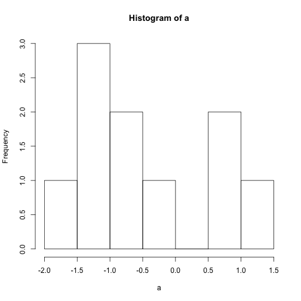 


We can rearrange the plot so that correlated variables are clustered together.


```r
corrgram(mm.matrix, order = T, upper.panel = panel.ellipse)
```

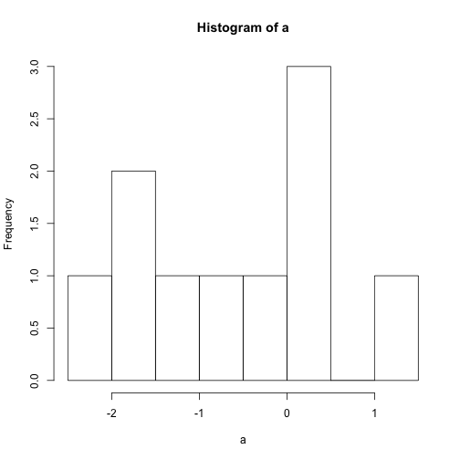 


### Linear Modelling
Finally we can build a simple model to describe and predict, e.g. Stress.

First we remove the missing observations.

```r
mm.nona <- na.omit(mm)
```


Then create a simple linear model, regressing all other variables against Stress.

```r
stress.lm.basic <- lm(Stress ~ ., mm.nona)
summary(stress.lm.basic)
```

```
## 
## Call:
## lm(formula = Stress ~ ., data = mm.nona)
## 
## Residuals:
##     Min      1Q  Median      3Q     Max 
## -1.3783 -0.4527 -0.0696  0.3656  2.1333 
## 
## Coefficients:
##              Estimate Std. Error t value Pr(>|t|)    
## (Intercept) -9.63e+01   4.02e+01   -2.40   0.0181 *  
## Date         7.10e-08   2.97e-08    2.39   0.0183 *  
## Health       1.49e-01   1.62e-01    0.92   0.3581    
## Energy       8.09e-02   8.74e-02    0.93   0.3567    
## MoodPos     -3.02e-01   1.54e-01   -1.97   0.0514 .  
## MoodInt      5.59e-01   6.84e-02    8.18  4.3e-13 ***
## Alertness   -1.60e-02   4.08e-02   -0.39   0.6953    
## Cognition   -2.32e-01   7.53e-02   -3.09   0.0025 ** 
## Hap         -3.07e-01   1.86e-01   -1.65   0.1017    
## LifeSat     -2.41e-01   2.36e-01   -1.02   0.3087    
## SlpTime      4.95e-04   1.16e-03    0.43   0.6702    
## SlpEff       3.35e-02   1.21e-02    2.77   0.0066 ** 
## Calories     1.38e-03   7.70e-04    1.79   0.0766 .  
## ModAct       1.06e-03   3.26e-03    0.33   0.7454    
## VigAct      -1.93e-02   1.90e-02   -1.02   0.3106    
## Steps       -6.93e-05   2.75e-05   -2.52   0.0130 *  
## ---
## Signif. codes:  0 '***' 0.001 '**' 0.01 '*' 0.05 '.' 0.1 ' ' 1
## 
## Residual standard error: 0.716 on 115 degrees of freedom
## Multiple R-squared:  0.617,	Adjusted R-squared:  0.567 
## F-statistic: 12.3 on 15 and 115 DF,  p-value: <2e-16
```


Then we can remove insignificant variables from the model through the stepwise algorithm.

```r
stress.lm.stepped <- step(stress.lm.basic)
```

```
## Start:  AIC=-72.52
## Stress ~ Date + Health + Energy + MoodPos + MoodInt + Alertness + 
##     Cognition + Hap + LifeSat + SlpTime + SlpEff + Calories + 
##     ModAct + VigAct + Steps
## 
##             Df Sum of Sq  RSS   AIC
## - ModAct     1       0.1 59.0 -74.4
## - Alertness  1       0.1 59.1 -74.3
## - SlpTime    1       0.1 59.1 -74.3
## - Health     1       0.4 59.4 -73.6
## - Energy     1       0.4 59.4 -73.5
## - VigAct     1       0.5 59.5 -73.3
## - LifeSat    1       0.5 59.5 -73.3
## <none>                   59.0 -72.5
## - Hap        1       1.4 60.4 -71.5
## - Calories   1       1.6 60.6 -70.9
## - MoodPos    1       2.0 61.0 -70.2
## - Date       1       2.9 61.9 -68.2
## - Steps      1       3.3 62.3 -67.5
## - SlpEff     1       3.9 62.9 -66.1
## - Cognition  1       4.9 63.9 -64.1
## - MoodInt    1      34.3 93.3 -14.5
## 
## Step:  AIC=-74.4
## Stress ~ Date + Health + Energy + MoodPos + MoodInt + Alertness + 
##     Cognition + Hap + LifeSat + SlpTime + SlpEff + Calories + 
##     VigAct + Steps
## 
##             Df Sum of Sq  RSS   AIC
## - Alertness  1       0.1 59.1 -76.2
## - SlpTime    1       0.1 59.2 -76.1
## - Energy     1       0.4 59.5 -75.5
## - Health     1       0.4 59.5 -75.4
## - VigAct     1       0.5 59.5 -75.3
## - LifeSat    1       0.6 59.6 -75.1
## <none>                   59.0 -74.4
## - Hap        1       1.4 60.4 -73.3
## - MoodPos    1       2.0 61.0 -72.1
## - Date       1       3.2 62.2 -69.5
## - Steps      1       3.4 62.4 -69.1
## - SlpEff     1       4.0 63.0 -67.9
## - Cognition  1       5.0 64.0 -65.8
## - Calories   1       9.1 68.2 -57.6
## - MoodInt    1      34.3 93.4 -16.4
## 
## Step:  AIC=-76.24
## Stress ~ Date + Health + Energy + MoodPos + MoodInt + Cognition + 
##     Hap + LifeSat + SlpTime + SlpEff + Calories + VigAct + Steps
## 
##             Df Sum of Sq  RSS   AIC
## - SlpTime    1       0.1 59.2 -78.0
## - Energy     1       0.4 59.5 -77.4
## - VigAct     1       0.5 59.6 -77.1
## - Health     1       0.5 59.6 -77.1
## - LifeSat    1       0.6 59.7 -77.0
## <none>                   59.1 -76.2
## - Hap        1       1.3 60.5 -75.3
## - MoodPos    1       2.1 61.2 -73.6
## - Date       1       3.2 62.3 -71.4
## - Steps      1       3.6 62.7 -70.5
## - SlpEff     1       3.9 63.0 -69.9
## - Cognition  1       5.0 64.1 -67.6
## - Calories   1       9.6 68.7 -58.5
## - MoodInt    1      34.7 93.8 -17.8
## 
## Step:  AIC=-77.96
## Stress ~ Date + Health + Energy + MoodPos + MoodInt + Cognition + 
##     Hap + LifeSat + SlpEff + Calories + VigAct + Steps
## 
##             Df Sum of Sq  RSS   AIC
## - Energy     1       0.4 59.6 -79.1
## - Health     1       0.5 59.7 -78.9
## - VigAct     1       0.5 59.8 -78.8
## - LifeSat    1       0.6 59.9 -78.6
## <none>                   59.2 -78.0
## - Hap        1       1.3 60.6 -77.0
## - MoodPos    1       2.2 61.4 -75.3
## - Date       1       3.0 62.3 -73.4
## - Steps      1       3.7 62.9 -72.1
## - SlpEff     1       4.0 63.2 -71.5
## - Cognition  1       4.9 64.1 -69.5
## - Calories   1       9.5 68.8 -60.5
## - MoodInt    1      36.1 95.3 -17.7
## 
## Step:  AIC=-79.08
## Stress ~ Date + Health + MoodPos + MoodInt + Cognition + Hap + 
##     LifeSat + SlpEff + Calories + VigAct + Steps
## 
##             Df Sum of Sq  RSS   AIC
## - VigAct     1       0.4 60.0 -80.2
## - Health     1       0.5 60.2 -79.9
## - LifeSat    1       0.6 60.2 -79.8
## <none>                   59.6 -79.1
## - Hap        1       1.3 60.9 -78.3
## - MoodPos    1       2.0 61.6 -76.9
## - Date       1       2.8 62.4 -75.1
## - SlpEff     1       3.6 63.2 -73.4
## - Steps      1       4.0 63.6 -72.7
## - Cognition  1       4.7 64.4 -71.1
## - Calories   1       9.4 69.0 -62.0
## - MoodInt    1      39.9 99.5 -14.0
## 
## Step:  AIC=-80.19
## Stress ~ Date + Health + MoodPos + MoodInt + Cognition + Hap + 
##     LifeSat + SlpEff + Calories + Steps
## 
##             Df Sum of Sq   RSS   AIC
## - LifeSat    1       0.5  60.5 -81.2
## - Health     1       0.5  60.5 -81.1
## <none>                    60.0 -80.2
## - Hap        1       1.2  61.3 -79.6
## - MoodPos    1       2.1  62.2 -77.6
## - Date       1       2.6  62.6 -76.6
## - SlpEff     1       3.5  63.6 -74.7
## - Steps      1       3.6  63.6 -74.6
## - Cognition  1       4.6  64.6 -72.5
## - Calories   1       9.2  69.2 -63.5
## - MoodInt    1      40.0 100.0 -15.4
## 
## Step:  AIC=-81.17
## Stress ~ Date + Health + MoodPos + MoodInt + Cognition + Hap + 
##     SlpEff + Calories + Steps
## 
##             Df Sum of Sq   RSS   AIC
## - Health     1       0.4  60.9 -82.2
## <none>                    60.5 -81.2
## - Hap        1       2.3  62.9 -78.2
## - Date       1       2.4  62.9 -78.0
## - MoodPos    1       2.4  63.0 -78.0
## - Steps      1       3.5  64.0 -75.9
## - SlpEff     1       3.5  64.0 -75.8
## - Cognition  1       4.9  65.4 -72.9
## - Calories   1       8.8  69.3 -65.4
## - MoodInt    1      40.2 100.7 -16.5
## 
## Step:  AIC=-82.25
## Stress ~ Date + MoodPos + MoodInt + Cognition + Hap + SlpEff + 
##     Calories + Steps
## 
##             Df Sum of Sq   RSS   AIC
## <none>                    60.9 -82.2
## - Hap        1       2.1  63.1 -79.7
## - Date       1       2.5  63.5 -78.9
## - MoodPos    1       2.6  63.6 -78.7
## - SlpEff     1       3.2  64.1 -77.6
## - Steps      1       3.8  64.7 -76.4
## - Cognition  1       4.8  65.8 -74.3
## - Calories   1       9.5  70.5 -65.2
## - MoodInt    1      40.8 101.8 -17.1
```

```r
summary(stress.lm.stepped)
```

```
## 
## Call:
## lm(formula = Stress ~ Date + MoodPos + MoodInt + Cognition + 
##     Hap + SlpEff + Calories + Steps, data = mm.nona)
## 
## Residuals:
##    Min     1Q Median     3Q    Max 
## -1.360 -0.486 -0.110  0.416  2.219 
## 
## Coefficients:
##              Estimate Std. Error t value Pr(>|t|)    
## (Intercept) -8.34e+01   3.66e+01   -2.28   0.0242 *  
## Date         6.14e-08   2.73e-08    2.24   0.0266 *  
## MoodPos     -3.36e-01   1.46e-01   -2.30   0.0232 *  
## MoodInt      5.85e-01   6.47e-02    9.04  2.9e-15 ***
## Cognition   -2.26e-01   7.28e-02   -3.11   0.0024 ** 
## Hap         -3.40e-01   1.64e-01   -2.07   0.0406 *  
## SlpEff       2.87e-02   1.14e-02    2.52   0.0129 *  
## Calories     1.42e-03   3.25e-04    4.37  2.6e-05 ***
## Steps       -6.65e-05   2.42e-05   -2.75   0.0069 ** 
## ---
## Signif. codes:  0 '***' 0.001 '**' 0.01 '*' 0.05 '.' 0.1 ' ' 1
## 
## Residual standard error: 0.707 on 122 degrees of freedom
## Multiple R-squared:  0.604,	Adjusted R-squared:  0.578 
## F-statistic: 23.3 on 8 and 122 DF,  p-value: <2e-16
```


Comparing the predict results with the actual.

```r
plot(fitted.values(stress.lm.stepped), mm.nona$Stress)
```

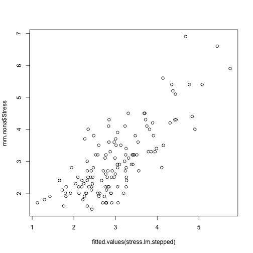 


Comparing stress with the significant variables.


